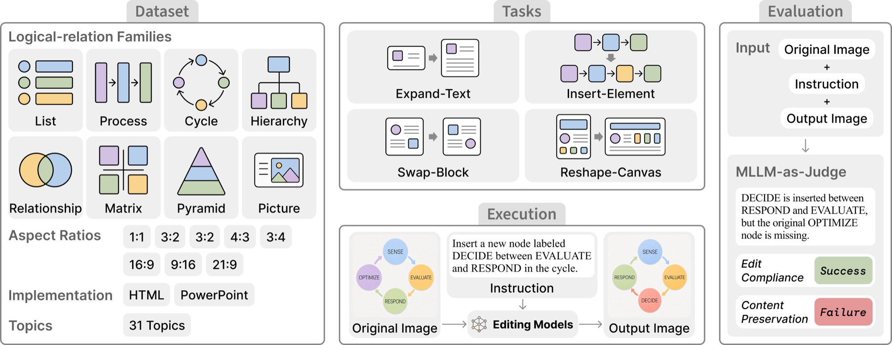

<div align="center">

<h1> InfoEdit: Probing Global Layout Reasoning in Infographic Editing
 </h1>
</div>

<div align="center">


</div>

<div align="center">
  🌐 <a href="https://infoedit.github.io">Website</a> |
  📚 <a href="https://huggingface.co/datasets/InfoEdit/InfoEdit">Data</a> |
  📃 <a href="https://arxiv.org/abs/2609.33286">Paper</a>
</div>

## 🎉 What's New

- **[2026.09.29]** 🔧 Code and data are released.
- **[2026.09.27]** 📣 The InfoEdit paper is on [arXiv](https://arxiv.org/abs/2609.33286).

## 🎏 Introduction

Editing an infographic is not like editing a photo. Infographics encode information through
**logical relations**, so changing one element forces the surrounding elements to adapt. We
call this global layout reasoning ability **reflow**, and InfoEdit measures it.

InfoEdit contains **1,000 infographics** (800 HTML, 200 PowerPoint) across **8 logical-relation
families**, paired with **4,000 editing instructions** over **4 editing tasks** — Expand-Text,
Insert-Element, Swap-Block and Reshape-Canvas — and a **reflow-aware evaluation protocol** in
which an MLLM judge scores Edit Compliance and Content Preservation separately. We evaluate
both pathways: **pixel-level** image editors and **code-level** editing over the HTML/PowerPoint
source. The best pixel-level editor reaches **62.0%** average success rate and the best
code-level system **67.9%**, while most pixel-level editors fall below **7%**.

<div align="center">

</div>

## 📄 Table of Contents

<details>
<summary>
Click to expand the table of contents
</summary>

- [🎉 What's New](#-whats-new)
- [🎏 Introduction](#-introduction)
- [🚀 Quick Start](#-quick-start)
  - [Setup Environment](#setup-environment)
  - [Download Data](#download-data)
  - [Fonts for PPT rendering](#fonts-for-ppt-rendering)
  - [Evaluate Models](#evaluate-models)
- [🔌 Alternative: an OpenAI-compatible proxy](#-alternative-an-openai-compatible-proxy)
- [🧪 Evaluating Your Own Model](#-evaluating-your-own-model)
- [📚 Data](#-data)
- [🗂️ Repository Layout](#️-repository-layout)
- [💬 Citation](#-citation)
- [📌 License](#-license)

</details>

## 🚀 Quick Start

### Setup Environment

You need **Python 3.10+**, and for the default backend a **Google Cloud project with billing
enabled** plus the [`gcloud` CLI](https://cloud.google.com/sdk/docs/install): editing and
judging run as [Vertex AI batch prediction](https://cloud.google.com/vertex-ai/generative-ai/docs/multimodal/batch-prediction)
jobs, roughly half the price of online calls. Code-level editing and judging can skip GCP
entirely and go through any OpenAI-compatible proxy instead — see
[Alternative: an OpenAI-compatible proxy](#-alternative-an-openai-compatible-proxy).

```shell
git clone https://github.com/InfoEdit/InfoEdit.git && cd InfoEdit
pip install -r requirements.txt
playwright install chromium        # HTML code-level path renders with Chromium

# only for the PPT code-level path:
#   macOS          brew install --cask libreoffice poppler
#   Debian/Ubuntu  apt-get install libreoffice poppler-utils
```

Optional, per backend:

| you want to run | you also need |
|---|---|
| code-level on HTML | `playwright install chromium` |
| code-level on PPT | LibreOffice **and** poppler, plus the [fonts](#fonts-for-ppt-rendering) |
| GPT-Image-2 | `OPENAI_API_KEY` |
| Seedream | `ARK_API_KEY` (Volcengine) |
| code-level via a proxy | `OPENAI_API_KEY` **and** `OPENAI_BASE_URL` |
| Qwen / Hunyuan | a CUDA GPU box; see `baselines/pixel/{qwen,hunyuan}/run.sh` |

Configure Google Cloud (skip on the proxy backend):

```shell
export GCP_PROJECT=your-project-id

# 1. authenticate (this is what the Python SDK uses)
gcloud auth application-default login
gcloud auth application-default set-quota-project $GCP_PROJECT

# 2. enable the APIs
gcloud services enable aiplatform.googleapis.com storage.googleapis.com --project $GCP_PROJECT

# 3. create the staging bucket batch jobs read and write through.
#    It must be a SINGLE region (us-central1), not the multi-region "us".
gcloud storage buckets create gs://${GCP_PROJECT}-batch-io --location=us-central1

# 4. record it for the run scripts
cp scripts/env.example.sh env.sh     # set GCP_PROJECT inside
source env.sh
```

### Download Data

```shell
huggingface-cli download InfoEdit/InfoEdit --repo-type dataset --local-dir data
```

Newer `huggingface_hub` releases rename that command to `hf download ...`. If neither is on
your PATH, the Python API does the same thing:

```shell
python -c "from huggingface_hub import snapshot_download; \
snapshot_download('InfoEdit/InfoEdit', repo_type='dataset', local_dir='data')"
```

### Fonts for PPT rendering

PPT slides are rendered with LibreOffice, which takes fonts from the system. The
reference images were rendered with the open fonts the benchmark deck uses, so install
exactly those fonts before any PPT code-level run — otherwise LibreOffice substitutes
whatever the machine has, the judge sees the font change as a style change, and PPT
scores drop for reasons unrelated to the editor.

The fonts are free: 111 static files from Google Fonts plus two icon fonts. Download them
into `fonts/`, next to the `fonts/fonts.conf` in this repository:

```bash
cd fonts
FAMILIES="Archivo:400,700,900 Archivo+Black:400 Arimo:400,700 Barlow:400,500,600,700
  Barlow+Condensed:400,500,700 Bebas+Neue:400 Cabin+Sketch:400,700 Carlito:400,700
  Comfortaa:400,700 DM+Sans:400,500,700 Figtree:400,700 Fira+Sans:400,500i,600i,700
  Gelasio:400,700 Inter:400,700 Lato:300,400,700 League+Spartan:400,700 Long+Cang:400
  Ma+Shan+Zheng:400 Monoton:400 Montserrat:300,400,600,700,800,900 Mukta:200,400,700
  Noto+Sans:400,700 Noto+Sans+Arabic:400,700 Noto+Sans+JP:300,400,700
  Noto+Sans+KR:400,700 Noto+Sans+SC:300,400,500,700,900 Noto+Sans+TC:300,400,700
  Noto+Serif+SC:400,500,700,900 Noto+Serif+TC:400,700 Nunito+Sans:400,700
  Open+Sans:300,400,600,700,800 Open+Sans+Condensed:700 Oswald:400,700
  Playfair+Display:400,700,900 Poppins:300,400,500,700 Racing+Sans+One:400
  Raleway:300,400,700 Roboto:300,400,500,700,900 Roboto+Condensed:300,400,700
  Roboto+Slab:400,700 Source+Sans+3:400,700 Source+Serif+4:400,700 Tinos:400,700
  ZCOOL+XiaoWei:400"
for spec in $FAMILIES; do
  fam=${spec%%:*}
  for w in $(echo "${spec#*:}" | tr , ' '); do
    case $w in *i) axis="ital,wght@1,${w%i}" ;; *) axis="wght@$w" ;; esac
    # an old user agent makes Google Fonts serve plain TrueType files
    url=$(curl -s -A "Mozilla/4.0" "https://fonts.googleapis.com/css2?family=$fam:$axis" | grep -o 'https://[^)]*' | head -1)
    curl -sfL -o "${fam//+/}-$w.ttf" "$url" || echo "failed: $fam $w"
  done
done
curl -sfL -o FontAwesome.ttf https://cdnjs.cloudflare.com/ajax/libs/font-awesome/4.7.0/fonts/fontawesome-webfont.ttf
curl -sfL -o linea-basic-10.ttf https://raw.githubusercontent.com/linea-io/Linea-Iconset/master/_basic/_ICONFONT/fonts/linea-basic-10.ttf
ls *.ttf | wc -l        # 113
cd ..
```

Nothing to install system-wide: for `SOURCE=ppt`, `scripts/run_edit.sh` and `scripts/run_eval.sh` point
LibreOffice at `fonts/fonts.conf` (via `FONTCONFIG_FILE`), which loads these files and
also maps proprietary names that an editor may write into its code — `Arial`, `Calibri`,
`Microsoft YaHei`, … — to the open font the deck uses in their place. HTML rendering is
not affected. To check the setup:

```bash
FONTCONFIG_FILE=$PWD/fonts/fonts.conf fc-match "Microsoft YaHei"   # NotoSansSC-400.ttf: "Noto Sans SC"
FONTCONFIG_FILE=$PWD/fonts/fonts.conf fc-match "Arial:bold"        # Arimo-700.ttf: "Arimo" "Bold"
```

If you call `baselines/code/ppt/edit.py` directly, run it from the repo root and export
`FONTCONFIG_FILE=$PWD/fonts/fonts.conf` yourself first.

On macOS, LibreOffice uses the system font manager instead of fontconfig: install the
downloaded `.ttf` files into `~/Library/Fonts`. The name mapping in `fonts.conf` then does
not apply, so code that names a font the Mac ships (Arial, Helvetica, …) renders with
that font — use Linux to reproduce the paper's PPT numbers exactly.

### Evaluate Models

Smoke test first — five examples, edit and score, end to end:

```shell
bash scripts/quickstart.sh
```

On the default Vertex backend, batch jobs sit in a queue before they start, so even five
examples usually take a few minutes — a run that prints `JOB_STATE_QUEUED` for a while is
working, not stuck.

Then the real thing, two steps per model:

```shell
# 1. produce edits
MODEL=gemini-2.5-flash-image TASK=add bash scripts/run_edit.sh

# 2. score them (Edit Compliance, Content Preservation, Success Rate)
MODEL=gemini-2.5-flash-image TASK=add bash scripts/run_eval.sh
```

`run_eval.sh` prints the EC / CP / SR table at the end, and both scripts print the exact
input and output paths when they start. Outputs are keyed by a run tag — the model name
for pixel pathways, `<model>_<pathway>` for code pathways, so `code` and `code_image` runs
of the same model stay apart:

```
edited_<source>_infographics[_code|_gpt|_seedream]/<tag>/<task>/   edits
eval_results/<tag>/                                                judgements
```

For example, `MODEL=gemini-3.5-flash PATHWAY=code TASK=add` on HTML writes edits to
`edited_html_infographics_code/gemini-3.5-flash_code/add/` and judgements to
`eval_results/gemini-3.5-flash_code/`.

Both scripts read the same environment variables:

| var | values | default |
|---|---|---|
| `MODEL` | editor model id — must match `PATHWAY` (see below) | *required* |
| `TASK` | `text_expand` · `add` · `swap_inter` · `aspect_ratio` | `text_expand` |
| `SOURCE` | `html` (800) · `ppt` (200) | `html` |
| `PATHWAY` | `image` · `code` · `code_image` · `gpt` · `seedream` | `image` |
| `LIMIT` | first N records; empty = all | all |
| `JUDGE` | judge model | `gemini-3.1-pro-preview` |
| `BACKEND` | `vertex` · `openai` ([proxy](#-alternative-an-openai-compatible-proxy), code pathways only) | `vertex` |

`MODEL` and `PATHWAY` have to agree, because the two pathways call different kinds of
model:

| PATHWAY | what it does | example MODEL |
|---|---|---|
| `image` | edits the rendered PNG with a Gemini **image** model | `gemini-2.5-flash-image` |
| `code` | rewrites the HTML/PPTX source with a **text** model | `gemini-3.5-flash` |
| `code_image` | same, but also shows the model the rendered original | `gemini-3.5-flash` |
| `gpt` | GPT-Image-2 (needs `OPENAI_API_KEY`) | `gpt-image-2` |
| `seedream` | Seedream (needs `ARK_API_KEY`) | `doubao-seedream-5-0-260128` |

Passing a text model with `PATHWAY=image` (or vice versa) will fail. Task names map to the
paper as: `text_expand`→Expand-Text, `add`→Insert-Element, `swap_inter`→Swap-Block,
`aspect_ratio`→Reshape-Canvas.

#### Running part of the benchmark

`LIMIT` takes the first N records of the task's file in order, and ids run 1..N, so
`LIMIT=400` is exactly ids 1–400 every time, for every task and every model. **Pass the
same `LIMIT` to both steps** — `scripts/run_edit.sh` and `scripts/run_eval.sh` slice independently, and
a mismatch makes the judge look for edits that were never produced and record them as
skips.

```shell
for TASK in text_expand add swap_inter aspect_ratio; do
  MODEL=gemini-3.5-flash PATHWAY=code TASK=$TASK LIMIT=400 bash scripts/run_edit.sh
  MODEL=gemini-3.5-flash PATHWAY=code TASK=$TASK LIMIT=400 bash scripts/run_eval.sh
done
```

Numbers from a partial run are not comparable with the paper's tables, which use all
800 HTML and 200 PPT items, but they are comparable across models that share a `LIMIT`.

## 🔌 Alternative: an OpenAI-compatible proxy

`BACKEND=openai` sends every call through one OpenAI-compatible gateway (LiteLLM, an
internal gateway, OpenAI itself) instead of Vertex AI, so GPT, Claude and Gemini are all
reached the same way and differ only by model name. It covers the **code-level**
pathways and the judge; pixel-level editing needs a model that returns images, which
the chat-completions API does not express, so it stays on Vertex.

```shell
export BACKEND=openai
export OPENAI_API_KEY=sk-...                         # the key your gateway issued
export OPENAI_BASE_URL=https://your-gateway/v1       # note the /v1 suffix
```

Calls are made online, `WORKERS` at a time (default 8 on this backend) — raise it if
your key allows more concurrency. Two things commonly go wrong: `OPENAI_BASE_URL` must
include the `/v1` prefix (the bare host gives 404s on every call), and the variables
must be exported (`source env.sh`, not `bash env.sh`). The OpenAI SDK also reads
`OPENAI_BASE_URL`, so **unset it before running `PATHWAY=gpt`** — otherwise GPT-Image-2
requests go to the proxy instead of OpenAI.

Gateways usually gate models per key, so probe a model before a long run:

```shell
python utils/llm_client.py --probe gpt-5.6-sol
```

```
  text         ✅  'ok'
  image input  ✅  'red'  -> usable as a judge
  json mode    ✅  '{"ok": true}'
```

If **text** fails the model is unusable on this key. If **image input** fails it can
still edit with `PATHWAY=code`, but it cannot be the judge or run `PATHWAY=code_image`.
**json mode** is informational — the judge never asks for it. Then run as usual:

```shell
MODEL=gpt-5.6-sol PATHWAY=code TASK=add bash scripts/run_edit.sh
MODEL=gpt-5.6-sol PATHWAY=code TASK=add bash scripts/run_eval.sh   # JUDGE must pass the image probe
```

## 🧪 Evaluating Your Own Model

You do not have to use our editing scripts. Produce edited images yourself, write them to
a directory named after your model, then point the judge at it:

```shell
python evaluation/evaluate_edits.py \
    --input_file data/editing_prompts/html.jsonl \
    --edited_dir  edited_html_infographics/my-model \
    --output_file eval_results/my-model/html.jsonl \
    --operation add --detailed \
    --model_path gemini-3.1-pro-preview \
    --use_batch --gcp_project "$GCP_PROJECT" \
    --gcp_location "$GCP_LOCATION" --batch_bucket_uri "$BATCH_BUCKET_URI"

python evaluation/summarize_eval.py --model my-model --prefix html --ops add
```

To judge through a proxy instead, replace the last two `evaluate_edits.py` lines with
`--backend openai --num_workers 8`.

Lay the edits out as `<edited_dir>/<task>/{id}_edited_1.png` — for the command above that
is `edited_html_infographics/my-model/add/1_edited_1.png`. The `{id}` must match the
`id` in the prompt record, and `_1` is the variant index.

## 📚 Data

The benchmark lives on the Hugging Face Hub at
[InfoEdit/InfoEdit](https://huggingface.co/datasets/InfoEdit/InfoEdit) and is **not**
tracked in git. The download above gives you:

```
data/
├── html_infographics/     800 × {.html, .png, .meta.json (canvas width and height)}
├── ppt_infographics/      200 × .png + master_deck.pptx (the source deck) and id_mapping.csv
└── editing_prompts/       html.<task>.jsonl (800 each), ppt.<task>.jsonl (200 each)
```

All main-experiment numbers use `prompt_index 0` of each record.

## 🗂️ Repository Layout

```
scripts/                    shell entry points — run them from anywhere
  run_edit.sh / run_eval.sh   the two commands you normally need
  quickstart.sh               end-to-end smoke test
  env.example.sh              template for env.sh (GCP project, API keys)
  show_jobs.sh                list Vertex AI batch jobs
  _common.sh                  shared settings, sourced by the run scripts

evaluation/                 the reflow-aware MLLM judge
  evaluate_edits.py           score edits (EC / CP / SR per item)
  summarize_eval.py           print the EC / CP / SR table from a results directory
  recover_batch_evaluate.py   resume an interrupted judging job

baselines/                  editor backends, grouped by the two pathways the
                            paper compares. Each backend is a folder with an
                            edit.py, plus recover_batch.py where the backend
                            runs as a resumable batch job:
  pixel/                      edit the rendered image  (main tables)
    gemini/                     Gemini image models (default)
    gpt/                        GPT-Image-2
    seedream/                   Seedream
    qwen/                       local Qwen-Image-Edit   (run.sh, not a PATHWAY)
    hunyuan/                    local HunyuanImage      (run.sh, not a PATHWAY)
  code/                       edit the source, then re-render
    html/                       HTML source
    ppt/                        PPTX source

utils/llm_client.py         OpenAI-compatible proxy client (BACKEND=openai)
fonts/fonts.conf            font setup for PPT rendering (fonts downloaded next to it)
```

This release covers the two experiments reported in the main tables: **pixel-level**
editing (Table 2) and **code-level** editing (Table 3). The dataset itself is
distributed via HuggingFace, so no dataset-construction code is included.

## 💬 Citation

If you find InfoEdit useful in your research, please consider citing:

```bibtex
@article{yang2026infoedit,
  title   = {InfoEdit: Probing Global Layout Reasoning in Infographic Editing},
  author  = {Yang, Cheng and Shi, Chufan and Wang, Huijuan and Shui, Bo and
             Wu, Yaokang and Tao, Muzi and Yan, Yibo and Ma, Xuezhe and
             Berg-Kirkpatrick, Taylor},
  journal = {arXiv preprint arXiv:2609.33286},
  year    = {2026}
}
```

## 📌 License

Code is MIT ([LICENSE](LICENSE)). Benchmark data is CC BY 4.0 ([DATA_LICENSE](DATA_LICENSE)).
